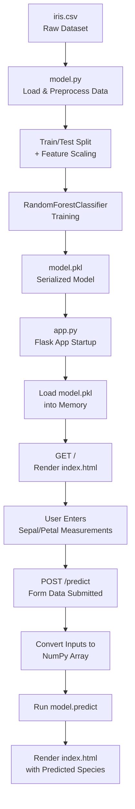

# ML Model Deployment using Flask

A minimal end-to-end example of deploying a machine learning model as a web application, using the classic **Iris dataset** and **Flask**. A Random Forest classifier is trained on the Iris data, serialized with `pickle`, and served through a simple HTML form so users can input flower measurements and get a live species prediction.

## Overview

This project demonstrates the full workflow of taking a trained scikit-learn model from a notebook/script into a small production-style web app:

1. Train a classifier on the Iris dataset (`model.py`)
2. Save the trained model to disk (`model.pkl`)
3. Load the model in a Flask app (`app.py`)
4. Serve a web form (`templates/index.html`) where users enter feature values
5. Return the predicted Iris species back to the page

## Demo

The app presents a simple form asking for:

- Sepal Length
- Sepal Width
- Petal Length
- Petal Width

On submission, the model predicts one of the three Iris classes: **Setosa**, **Versicolor**, or **Virginica**.

## Project Structure

```
ML-Model-Deployment-using-Flask/
├── app.py              # Flask application (routes + model inference)
├── model.py             # Model training script (loads iris.csv, trains, saves model.pkl)
├── model.pkl             # Pickled, trained RandomForestClassifier
├── iris.csv               # Iris dataset used for training
├── templates/
│   └── index.html          # Front-end form and prediction display
└── static/
    └── css/
        └── style.css         # Styling for the web page
```

## Workflow Structure

The project follows a straightforward **train → serialize → serve → predict** pipeline:



**Stage breakdown:**

| Stage | File | Description |
|---|---|---|
| 1. Data Loading | `model.py` | Reads `iris.csv` into a pandas DataFrame |
| 2. Preprocessing | `model.py` | Splits data into train/test sets, scales features with `StandardScaler` |
| 3. Training | `model.py` | Fits a `RandomForestClassifier` on the training set |
| 4. Serialization | `model.py` | Saves the trained model to `model.pkl` via `pickle` |
| 5. App Startup | `app.py` | Loads `model.pkl` into memory when the Flask server starts |
| 6. Form Rendering | `app.py` + `templates/index.html` | Serves the input form on `GET /` |
| 7. Prediction Request | `app.py` | `POST /predict` receives form values, converts them to a NumPy array |
| 8. Inference | `app.py` | Runs `model.predict()` on the input features |
| 9. Response | `app.py` + `templates/index.html` | Re-renders the page with the predicted Iris species |

> If GitHub doesn't render the diagram above (Mermaid support varies by viewer), refer to the stage breakdown table for the same flow in tabular form.

## Tech Stack

- **Python 3**
- **Flask** – web framework serving the app and API endpoint
- **scikit-learn** – model training (`RandomForestClassifier`, `StandardScaler`, `train_test_split`)
- **pandas / NumPy** – data loading and manipulation
- **HTML/CSS** – front-end form

## Getting Started

### Prerequisites

- Python 3.7+
- pip

### Installation

1. Clone the repository:

   ```bash
   git clone https://github.com/Yaseen-2004/ML-Model-Deployment-using-Flask.git
   cd ML-Model-Deployment-using-Flask
   ```

2. Install the required dependencies:

   ```bash
   pip install flask numpy pandas scikit-learn
   ```

   > Tip: it's a good idea to do this inside a virtual environment (`python -m venv venv`).

### (Optional) Retrain the model

A pre-trained `model.pkl` is already included, so this step is optional. To retrain it yourself:

```bash
python model.py
```

This loads `iris.csv`, splits it into train/test sets, scales the features, trains a `RandomForestClassifier`, and writes the result to `model.pkl`.

> **Note:** `model.py` and `app.py` currently reference the dataset/model using hardcoded absolute Windows paths (e.g. `C:\Upendra\...`). Update these to relative paths (e.g. `"iris.csv"` and `"model.pkl"`) before running on your own machine.

### Run the app

```bash
python app.py
```

By default, Flask will start the app at:

```
http://127.0.0.1:5000/
```

Open that URL in your browser, fill in the four flower measurements, and click **Predict** to see the classified species.

## How It Works

- `model.py` trains a `RandomForestClassifier` on the Iris dataset (`Sepal_Length`, `Sepal_Width`, `Petal_Length`, `Petal_Width` → `Class`) and serializes it with `pickle`.
- `app.py` loads `model.pkl` at startup and exposes two routes:
  - `GET /` — renders the input form (`index.html`)
  - `POST /predict` — reads the submitted form values, converts them to a NumPy array, runs `model.predict()`, and re-renders the page with the predicted species.

## Possible Improvements

- Replace hardcoded file paths with relative paths for portability.
- Add input validation and error handling for the prediction form.
- Add a `requirements.txt` file for easier dependency installation.
- Expose a JSON API endpoint (in addition to the HTML form) for programmatic access.
- Add unit tests for the model training and prediction logic.

## License

No license file is currently specified for this repository. Consider adding one (e.g. MIT) if you intend for others to reuse this code.

## Acknowledgements

- [Iris dataset](https://archive.ics.uci.edu/dataset/53/iris) — a classic dataset for classification tasks.
- Front-end form template adapted from [this CodePen](https://codepen.io/frytyler/pen/EGdtg).
